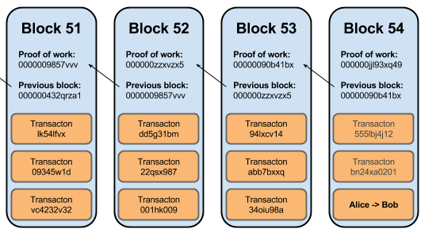

## Ethereum Smart Contracts Intro 

---

## Emanuel Mota - @emota7
Founder of Yari Labs

emanuel@yarilabs.com


@yarilabs

---
## About the Talk 

* Intro 
* Blockchain Overview
* Bitcoin vs Ethereum
* Smart Contracts 
* Solidity 
* Questions 

---
## Intro 

Quick questions about the audience

---
## Blockchain Overview
+++

### Blockchain Overview
* A blockchain is a globally shared, transactional database. 
* everyone can read entries in the database 
* changes can only happen via transactions accepted by all others
+++

### Blockchain Overview
* transactions are always cryptographically signed
* transactions are bundled in blocks and chained together 



---

## Bitcoin vs. Ethereum

---

### Bitcoin
* Cryptocurrency (Bitcoin)
* Bitcoin Blockchain
* One shared distributed ledger 
* Support for a "Script"
* Limited smart contracts capabilities
+++

### Ethereum
* Cryptocurrency (Ether)
* Bitcoin like distributed ledger 
* Ethereum Virtual Machine (EVM) 
* Turing complete
+++

### Ethereum
* Ethereum Blockchain
  * Contracts (code) 
  * Storage
  * Logs
  * Events
+++

### Ethereum
* Two kinds of accounts 
  * External Accounts (Wallets controlled by humans)
  * Contract Accounts (controlled by code)
  * every account has a balance 
+++

### Ethereum
* Code execution costs GAS 
* Transaction is a message sent from one account to another and can have a data
  payload

---

## Smart Contracts 

---

### Smart Contracts

> "A smart contract is a computer program that directly controls digital assets
> and which is run in such an environment that it can be trusted to faithfully execute."
<div style="text-align: right"> (Vitalik Buterin) </div>

---

## What are the implications !?

---
### Smart Contracts 

Smart contract flow of data 


+++

### source for smart contracts section: https://solidity.readthedocs.io/

+++

### Smart Contracts 
* Contract = code (i.e. functions) and data (its state) that resides at a specific address on the Ethereum blockchain
* EVM is the runtime for Smart Contracts on Ethereum
* Accounts have a persistent memory area which is called storage: key-value store that maps 256-bit words to 256-bit words

+++

### Smart Contracts 
* Contracts can neither read nor write to any storage apart from its own
* Contracts also have access to memory - linearly and can be addressed at byte level
* Memory is expanded by a 256bits when reading or writing & expansion must be paid in gas 

+++

### Smart Contracts 
* Contracts can call other contracts (they can even call themselves)
* 1024 max call stack depth
* call (new contexts) vs delegatecall (same context, e.g. msg.sender + msg.value)
* Events
* Contracts can purge themselves from the blockchain (OPCODE selfdestruct)

+++

### Smart Contracts 
* Contracts are defined through a transaction sent to 0x000.....000 (zero acc)
* Data of the transaction is the compiled contract

+++

### Smart Contracts Programming Languages 
* Available Programming languages 
  * Solidity (Javascript/Java like)
  * Serpent (Python inspired)
  * LLL (Lisp inspired)
  * others in the making ...

---

## Solidity Programming Language

---

### Solidity 
##### Simple storage demo

```javascript
pragma solidity ^0.4.0;

contract SimpleStorage {
    uint storedData;

    function set(uint x) {
        storedData = x;
    }

    function get() constant returns (uint) {
        return storedData;
    }
}

```
* Anyone can call *set* anytime overwriting the value. 
* The history would be preserved on the Blockchain. 

+++
### Solidity 
##### Implementing your own coin

```
pragma solidity ^0.4.0;

contract Coin {
    // keyword "public" exposes vars to the outside.
    address public minter;
    mapping (address => uint) public balances;

    // Events allow light clients to react on changes.
    event Sent(address from, address to, uint amount);

    // The constructor is run only on creation.
    function Coin() {
        minter = msg.sender;
    }
// continues on next page ...
``` 
+++

### Solidity 
##### Implementing your own coin

```
// from previous page ...

    function mint(address receiver, uint amount) {
        if (msg.sender != minter) return;
        balances[receiver] += amount;
    }

    function send(address receiver, uint amount) {
        if (balances[msg.sender] < amount) return;
        balances[msg.sender] -= amount;
        balances[receiver] += amount;
        Sent(msg.sender, receiver, amount);
    }
}
```
+++

### Solidity
##### stop/remove a contract from blockchain: selfdestruct ! 

```
pragma solidity ^0.4.0;

contract owned {
    function owned() { owner = msg.sender; }
    address owner;
}

// a contract can be derived from another contract
contract mortal is owned {
    function kill() {
        if (msg.sender == owner) selfdestruct(owner);
    }
}

//...
}
```

---
## Ethereum Challenges 
---

### Ethereum Challenges 

* Transaction takes a couple of minutes to be mined
* Storage and execution is expensive
* Ecosystem is young
+++

### Ethereum Challenges 
Deal with immutability
*  Test contracts fully before deployment   
*  Revert payments you don’t expect
*  Avoid unrecoverable states

+++

### Ethereum Challenges 
#### Example of a re-entrancy attack problem

```
mapping (address => uint) private balances; 
    // msg.sender is a user withdrawing funds 
    function withdraw() public {
        uint amount = balances[msg.sender];
        if (!(msg.sender.call.value(amount)())) 
              { revert; }
        balances[msg.sender] = 0; 
    }
```
This can be exploited by an external contract msg.sender calling
withdraw again (line 4) while balance is still non zero

---

## Interesting technology OFF-CHAIN

---

### Interesting technology OFF-CHAIN
* Oracles (ex: http://www.oraclize.it) 

* Whisper - comunication protocol for DApps
    (https://github.com/ethereum/wiki/wiki/Whisper)

* P2P Data Storage
  * Swarm - distributed storage with
      incentives (https://github.com/ethersphere/swarm)
  * IPFS - Interplanetary Filesystem (https://ipfs.io)

---
## Some Usefull Links
---

### Some Usefull Links
* Online compiler https://ethereum.github.io/browser-solidity/
* Another online compiler https://etherchain.org/solc
* Online tools https://testnet.etherscan.io https://etherscan.io (block explorer, tx
submit)

+++

### Some Usefull Links
* https://etherchain.org/
* http://ether.fund/contracts/ (contract repository w/ source code)
* Infura.io (so you don’t have to run your own node/s)
* Truffle  https://github.com/ConsenSys/truffle. 
* Embark https://github.com/iurimatias/embark-framework
* Open Zeppelin https://openzeppelin.org/

---

## Questions ?

@yarilabs

---

## Emanuel Mota 

### http://yarilabs.com  
### @yarilabs


* emanuel@yarilabs.com 
* twitter: @emota7
* github: emanuel
